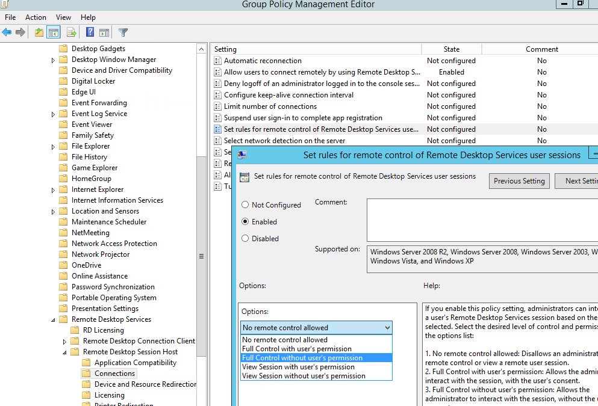

# Old but Gold - Sysadmin Techniques for Windows Enumeration(And how to detect them!)
As threat actors and red teams move on with more and more obscure techniques for evading defensive technologies and teams. The older legitimate tools are left behind, some of which enable enumeration via legitimate graphical user interface (GUI) functions (and can be very difficult to detect). Here are some old but gold system administrator tools and functions to help you in your next engagement:

- Backup Files
- RDP Shadowing 
- Management Console (MMC)/ Remote Server Administration Tools (RSAT)
- SYSTEM Shell hijacking

While some of these are already detectable with logging and anomalous activity, anything that veers away from command prompt and PowerShell usage is a win for offensive security. From a detection standpoint however Sysmon and Windows Event Logs + Splunk can be the saviour. If you are unsure how to setup Sysmon/Splunk I've previous written another post about this on my [blog](https://blog.zsec.uk/ltr-d101-splunk/).

## Backup Files & Extracting Backups
The first technique is something that may be found on older networks or where you land into an environment with access to backups. Machine backup files typically come in all different sizes but can be incredibly useful for us as attackers and equally a nightmare for defenders as once the files are extracted there's little to nothing that can be done! 

The root cause of this particular one is down to asset and access management, often on legacy networks there may be file shares or similar with information just hanging around for users to access. 

If you find yourself in a network share or on a system that contains a BKF file here are the steps required to extract the juicy information from it. 

First you'll need an older tool called NTBackup which is [available here](https://github.com/ZephrFish/OldGold). This will enable you to open the BKF file and from here the NTDS and System files can be extracted if the BKF is of a domain controller. The location of these files is:

- NTDS.dit; C:\Windows\NTDS.dit
- SYSTEM File; C:\Windows\System32\config\SYSTEM

Once the NTDS and SYSTEM file have been extracted from the backup,  the next step is to extract password information from the database. This can be achieved in several ways, 

### Defending and Mitigating 

## Remote Desktop Protocol Shadowing & Control
A useful feature built into the RDP service on windows that allows server administrators to either view or take control of RDP sessions. This enables you to shadow a session without first RDPing into the server. From an elevated command prompt on the server, run `QWINSTA` to get a list of the sessions available to be shadowed on a target machine.

In order to effectively leverage this feature there are a few variables that need to be correct, first you need to be local administrator on the endpoint, domain admin will also work. 

In addition, RDP shadowing needs to be enabled on the estate. This can be checked either within group policy or the registry:

GPO:
`Computer Configuration -> Policies -> Administrative Templates -> Windows components -> Remote Desktop Services -> Remote Session Host -> Connections`
Value: `Set rules for remote control of Remote Desktop Services user sessions`.

Registry:
`REG query "HKLM\SOFTWARE\Policies\Microsoft\Windows NT\Terminal Services\Shadow"`

The allowed values are (the one we are most interested in is if it returns 2; full control without users's permission)

- 0 – disable remote control;
- 1 — full control with user’s permission;
- 2 — full control without user’s permission;
- 3 — view session with user’s permission;
- 4 — view session without user’s permission.

### Defending and Mitigating 

## Windows Management Console (MMC)
There are a lot of attacks that can be done achieved just by having domain credentials and access to the network(not necessarily on a domain joined machine). Of the tools used for 

### Defending and Mitigating 

## System Shell Hijacking
One that requires local system access on a machine, this technique enables you to hijack users' sessions without their password provided you have local system or the ability to start a system shell on the machine. 

### Defending and Mitigating 

## Remote Server Administration Tools (RSAT)
For a lot of engagements you may find yourself operating from a VM outside the domain

### Defending and Mitigating 

